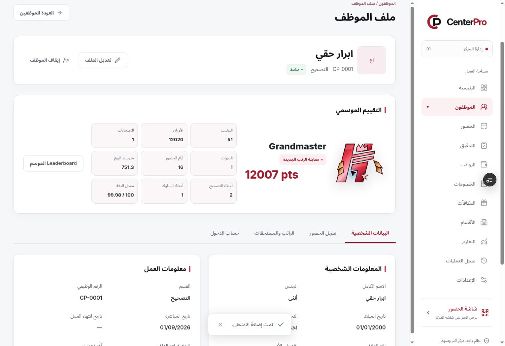
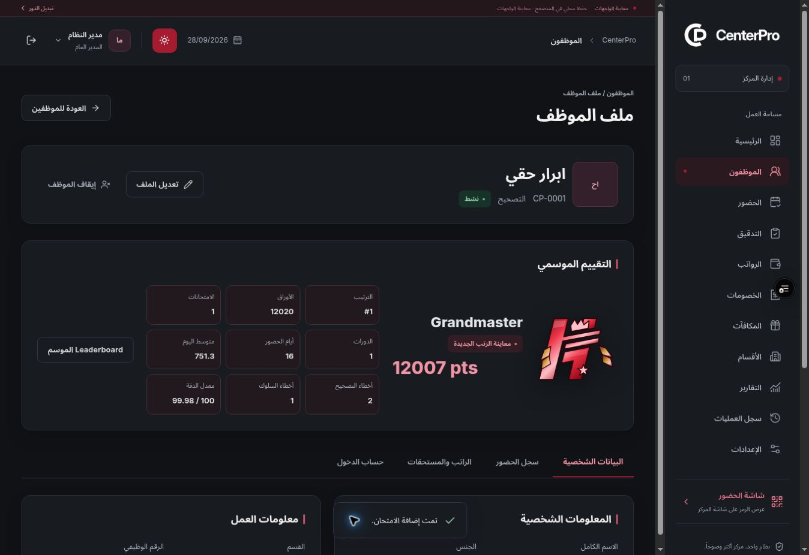

# Native ranks and UI clarity — Phase 1 Preview

## Supplied patch

- Attachment: `CenterPro_native_ranks_ui_clarity(1).patch`.
- Exact copy: [native-ranks-ui-clarity.patch](patches/native-ranks-ui-clarity.patch).
- SHA-256: `5cb888183bd6039d02efb45a42b88bd015a4c31f491217b78d14a67ff6fbe9e4`.
- Base commit: `3a1e0d97f09645ae86fda1e7a1660111c0c88314`.

This is the authorized frontend approval phase. No database, authentication backend, real payroll persistence or server QR validation was added. No new Vercel environment variables are required.

## Changes

- Replaced the displayed PNG ranks with native SVG emblems based on the Hassan Falah mark. All 22 rank combinations have tier palettes and level decorations; Grandmaster has its own crown and ornamentation. The old PNG caption/cropping issue no longer appears in the UI.
- Per-instance gradient/clip identifiers prevent conflicts when multiple ranks are displayed together. Shine stays inside the vector geometry and respects reduced motion.
- Removed duplicate rank labels in profile and employee summaries, and removed the seasonal motivational phrase.
- Enlarged typography, controls, tables and card spacing across people, departments, attendance, evaluations, finance and the application shell. Light and dark modes have explicit supporting colors.

## Integration corrections

- Preserved owner-entered department descriptions while removing the generic fallback and repeated form introductions.
- Kept global and finance screen typography from overriding report print sizing.
- Strengthened light-mode table-header/sidebar-caption contrast and allowed enlarged profile/department names to wrap.
- Allowed long season and cycle filters to wrap onto a full header row on tablet-sized employee evaluation pages.
- Made administrative account rows in Settings wrap and stack on small phones, retaining larger type and full account names.
- The first build encountered a stale Turbopack cache error. Moving that cache out of the project restored the normal production build; no dependency or build configuration changes were needed.

## Verification and deployment

- Application commit: `89567dbefd3142ee67140d55c03caca509e0a494`, pushed to `main` and `preview/ui-approval`.
- Preview: https://centerpro-o34ou9vsu-hussam9329s-projects.vercel.app/login
- Vercel deployment: `dpl_4W2bj9tWsZinAkQuT3K4ZBqfACkV`, verified `READY`, target `null` (Preview).
- GitHub quality run: https://github.com/Hussam9329/CenterPro/actions/runs/37324455205

| Gate | Result |
| --- | --- |
| ESLint | Passed |
| Strict typecheck | Passed |
| Unit/domain tests | 196 passed |
| Next.js production build | Passed |
| Browser suite | 122 passed in GitHub CI |

The first complete local browser run passed 119 of 122 scenarios and exposed the three width issues corrected above (employee evaluation at 768/1024px and populated Settings at 360px). After correction, all 12 targeted responsive scenarios passed against a freshly built application. The final GitHub run passed every gate and all 122 browser scenarios against the complete source revision.

Added browser coverage renders all 22 native ranks in populated light and dark seasonal leaderboards, verifies distinct painted output and independent SVG references, rejects bitmap rank requests, and checks reduced-motion behavior. Profile, department, employee-home and print regression checks retain full names, user descriptions, single rank labels and compact A4 output. Existing business, permission, responsive and accessibility coverage remains intact.

## Live Preview review

Verified the new deployment through the browser: loaded the seven optional test accounts, created a season/cycle/exam, and entered `12020` papers, `2` correction errors and `1` behavior error as the test auditor. Automatic save produced `12007` points. The admin employee profile displayed the native Grandmaster emblem cleanly in both themes, with a single title. After closing the exam, the corrector's home displayed the published Grandmaster result with the removed phrase absent.

These review records exist only in that browser's preview session. A fresh visitor still starts with empty operational collections.

