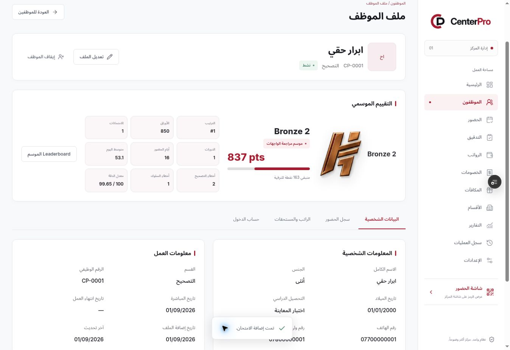

# Rank assets and audit hub patch — Phase 1 Preview

## Source and scope

- Owner attachment: `CenterPro_rank_assets_audit_hub_ui_cleanup(1).patch`.
- Exact archived copy: [rank-assets-audit-hub-ui-cleanup.patch](patches/rank-assets-audit-hub-ui-cleanup.patch).
- SHA-256: `585e82dae3a23dc7efeddce9a36e1069d63fab09ae72af727400f627b1b56487`.
- Applied to `fc9799ed1022d2e96698abb5ca01f0c5ee634e36`.

This remains the authorized frontend approval phase. No Neon connection, production authentication, payroll persistence or secure QR backend was added. No Vercel environment variables are required.

## Delivered changes

- All 22 supplied PNG rank assets replace generated rank vectors. Images retain their original bytes and aspect ratios. The optional shine uses the same image's alpha mask and respects reduced motion.
- The administration audit hub links to separate seasons, evaluation cycles and exams pages, with current counts and status.
- Corrector employee profiles show seasonal rank, progress and detailed statistics. Admin sees live scores; employee home continues to use published exams only.
- Login uses `CenterPro معك بكل خطوة.` and the requested centered presentation. Login and the application footer use `Kal-EL VISIONS © 2026`.
- Applied the requested copy cleanup across attendance, employee, finance, reports and settings screens.

## Integration corrections

- Repaired nine malformed `Card` JSX tags in the supplied patch so it compiles.
- Season archive sets its Baghdad closing date before building the frozen snapshot. Season/cycle audit events retain snapshot counts.
- Existing seasonless cycles remain visible and closable. Season → cycle → exam archive links, contextual selectors and detail Back links remain available. Archived exam names and dates come from frozen snapshots.
- Archived profile links select their specific season. Correctors absent from an archived snapshot do not receive fabricated zero-point rank cards; auditors do not receive corrector rank cards.
- Rank progress has accessible semantics. Long cycle names wrap inside hub cards at intermediate desktop/tablet widths. Scoped label styles preserve the branded badge colors and pass contrast checks. Profile statistics stack at tablet widths.

## Supplied artwork limitation

`public/ranks/grandmaster.png` contains stray source-sheet text at the top and a clipped lower emblem edge. This is present in the owner's binary patch, not introduced by rendering. The supplied asset is preserved unchanged; replacing it requires a clean original artwork file.

## Verification and deployment

Application commit: `eb6cb4668a7aac108d1261a96a6e78fe7d6c5311`, pushed to `main` and `preview/ui-approval`.

Local gates: lint, strict typecheck, all 196 unit/domain tests and production build pass. The first browser run passed 112 scenarios and identified five failures from one new test-fixture chronology error and two CSS issues. After fixes, all 15 targeted hub, eight-width responsive, accessibility and dark-mode scenarios pass. The archived fixture now follows the real season/cycle chronology without relaxing domain guards.

Live Preview: https://centerpro-fjp0jecdc-hussam9329s-projects.vercel.app/login

Deployment: `dpl_DKfWPfAZE3uctB8btmpei1FvThbs`, state `READY`, target `null` (Preview), source commit `eb6cb4668a7aac108d1261a96a6e78fe7d6c5311`. No Production deployment was made.

Live browser verification confirmed the new login text/copyright, explicit seven-account loader, hub navigation, season → cycle → exam creation, auditor autosave, admin profile live rank (`837 pts`, `Bronze 2`, 850 papers minus 2 correction errors × 5 and 1 behavior error × 3), exam closing, and the same published rank on corrector home. These were browser-local test records.

[GitHub CI run 37224242105](https://github.com/Hussam9329/CenterPro/actions/runs/37224242105) completed successfully for the exact application commit. All gates passed: lint, strict typecheck, 196 unit/domain tests, production build and all 117 browser tests. Browser coverage includes eight viewport sizes, light/dark accessibility, the new hub and contextual archives, live-vs-published profile ranks, missing archive rows, legacy seasons/cycles, payroll, attendance, autosave and permission regressions.

The follow-up documentation commit updates this handoff, README and the current UI contract only; the deployed app and verified Preview branch remain at the tested application commit. UI approval is still required before Phase 2.
