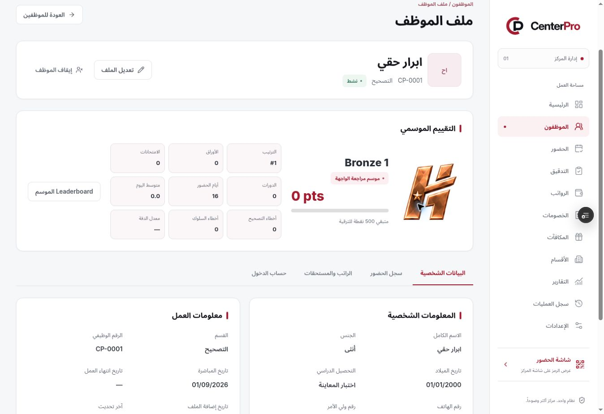
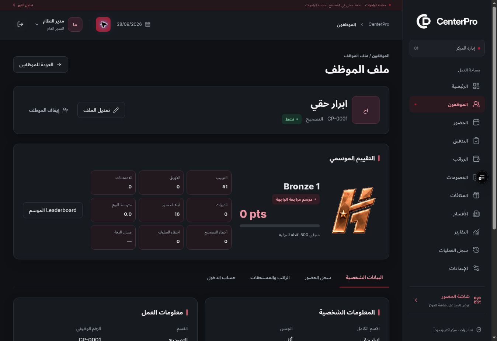

# UI clarity and rank assets — Phase 1 Preview

## Supplied patch

- Attachment: `CenterPro_ui_clarity_rank_assets(1).patch`.
- Exact archive: [ui-clarity-rank-assets.patch](patches/ui-clarity-rank-assets.patch).
- SHA-256: `5b9e31e0c9fdf527cc7cb6bded608ecfa906d86eb3261d5265438596eaec936a`.
- Base commit: `9b7e374`.

This remains the authorized frontend approval phase. No Neon connection, backend authentication, production financial persistence or real QR validation was added. No new Vercel environment variables are required.

## Implemented changes

- Replaced the prior SVG renderer and all 22 rank PNGs with the supplied faceted, transparent assets. All source images remain byte-for-byte identical to the patch, 512×512 RGBA, with transparent canvas margins.
- Removed CSS shadows and separate rank tiles. Shine is clipped using the displayed asset's alpha mask and respects reduced motion.
- Applied the supplied typography, spacing, control, table and light/dark appearance changes.
- Removed redundant shared page/card descriptions and selected dashboard, employee and attendance hints, keeping validation, confirmations and operational warnings.
- Made notifications dismiss automatically after 3200 ms, without a manual close control as specified in the patch.

## Integration corrections

- Confined the new screen design rules to screen media so they do not override compact printed reports.
- Restored the mobile content offset and top-bar dimensions that the late desktop overrides would otherwise replace; preserved the crimson summary-card background in dark mode.
- Matched the large mobile badge box to the square images at 104×104, keeping image and mask alignment.
- Assigned notification sequence IDs and keyed rendering so a replacement message restarts its CSS animation and dismissal interval, including repeated messages in the same millisecond. Reduced motion removes the toast animation while retaining automatic dismissal.
- Adapted rank tests to the two mounted desktop/mobile layouts, verified all 22 distinct browser-painted images and retained per-card fit, alpha transparency, mask alignment and accessibility coverage.
- Added three notification regression scenarios. Domain calculations, publication rules, attendance constraints, archive behavior and permissions remain unchanged.

## Verification and deployment

- Application commit: `e678ed78b1428699d03f100aee2e806087c56978`, pushed to `main` and `preview/ui-approval`.
- Verified Preview entry: https://centerpro-2o58wyoht-hussam9329s-projects.vercel.app/login
- Vercel deployment: `dpl_6F6gAA26XVa9r1dUibfxcTimZ1MH`, state `READY`, target `null` (Preview), source commit matching the application commit above. No Production deployment was made.
- [GitHub quality run 37659322209](https://github.com/Hussam9329/CenterPro/actions/runs/37659322209) completed successfully against the exact application commit.
- Local lint, strict typecheck, 196 unit/domain tests, 125 browser scenarios and production build all passed. The complete local browser suite finished in 4.7 minutes.
- Coverage includes all 22 rank images in light and dark views, alpha masks, reduced motion, eight responsive widths, accessibility checks, printed reports, notification replacement, and the existing attendance, evaluation, permission and archive regressions.
- Live Preview review loaded the existing mock test data, signed in as the mock administrator, checked the dashboard and employee list, opened a local mock season, observed its notification disappear automatically, and verified the supplied Bronze 1 image in the employee profile in both themes. The screenshots below contain mock data only.
- No environment variables need to be added or changed for this patch. Backend and database integration remain pending explicit UI approval.

### Live Preview evidence

